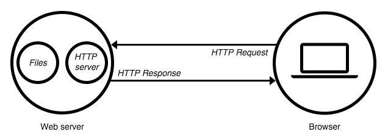
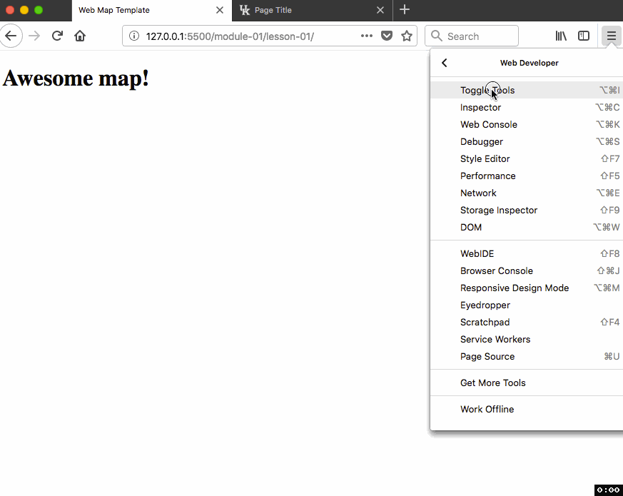
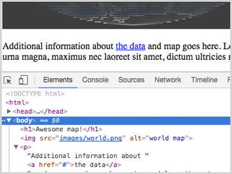
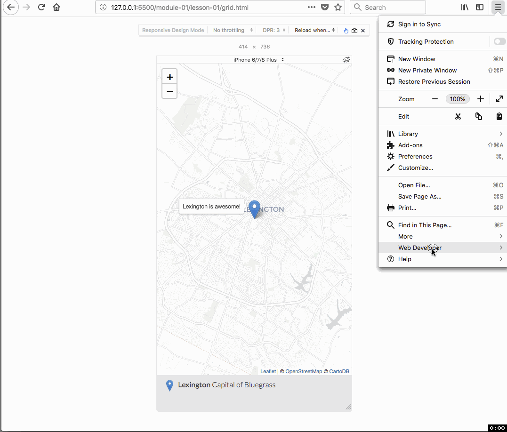

# Lesson 01: Foundations of the technology stack: HTML, CSS, and JavaScript

## Goals

In this module, you will look more closely at the three cornerstones of web design – HyperText Markup Language (HTML), Cascading Styles Sheets (CSS), and JavaScript (JS). You will create a basic web page template that will be used and modified in future lessons and labs. You will focus on mobile, responsive web design so that your page can adapt to many different screen sizes. 

## Table of Contents

<!-- TOC -->

- [Lesson 01: Foundations of the technology stack: HTML, CSS, and JavaScript](#lesson-01-foundations-of-the-technology-stack-html-css-and-javascript)
    - [Goals](#goals)
    - [Table of Contents](#table-of-contents)
    - [Overview](#overview)
    - [Understanding the HTML document and Document Object Model (DOM)](#understanding-the-html-document-and-document-object-model-dom)
        - [Using the browser developer tools](#using-the-browser-developer-tools)
    - [Structuring content with HTML](#structuring-content-with-html)
        - [heading elements](#heading-elements)
        - [image element](#image-element)
        - [paragraph element](#paragraph-element)
        - [anchor element](#anchor-element)
        - [list element](#list-element)
        - [division element](#division-element)
        - [semantic elements](#semantic-elements)
        - [span element](#span-element)
    - [Select and style HTML markup with CSS rules](#select-and-style-html-markup-with-css-rules)
        - [CSS Syntax](#css-syntax)
        - [Native HTML elements](#native-html-elements)
        - [Elements with id and class attributes](#elements-with-id-and-class-attributes)
            - [Single unique element with `#id` attribute](#single-unique-element-with-id-attribute)
            - [Multiple elements with `.class` attribute](#multiple-elements-with-class-attribute)
        - [Responsive web page design](#responsive-web-page-design)
        - [Add external CSS files](#add-external-css-files)
    - [Controlling behavior with JavaScript](#controlling-behavior-with-javascript)
        - [JavaScript in a browser's developer tools and Console](#javascript-in-a-browsers-developer-tools-and-console)
        - [Using JQuery](#using-jquery)
    - [Commenting your code](#commenting-your-code)
    - [Code structure, cleanliness, and indentions](#code-structure-cleanliness-and-indentions)
    - [Leaflet and your first hello world map](#leaflet-and-your-first-hello-world-map)
    - [Addendum: Two additional responsive templates](#addendum-two-additional-responsive-templates)
        - [CSS Grid Module](#css-grid-module)
        - [CSS Classic Grid](#css-classic-grid)
    - [Additional Resources](#additional-resources)
    - [Definitions](#definitions)

<!-- /TOC -->

## Overview

This lesson will provide you with an introduction to the foundational technology stack used in web map development. We will introduce you to three distinct web technologies (HTML, CSS, and JavaScript), which work together to produce a web page and map application. Web map design is achieved using these three technologies to structure **content** (HTML), and give **form** (CSS) and **behavior** (JavaScript) to this content. We define design in this sense as the convergence of content, form, and behavior.

Additionally, we'll practice writing these technologies within our text editor. We do not require you to use a specific text editor. One of the following is recommended (they all offer much of the same basic functionality and can be extended through various plugins or extensions). Most of our documentation uses VS Code and Atom.

* [Visual Studio Code](https://code.visualstudio.com/)
* [Atom](https://atom.io/)
* [Sublime](https://www.sublimetext.com/)

We'll also be using tools within our web browser to inspect the Document Object Module (DOM) and debug our code as we write it. It is recommended that you develop using either Chrome or Firefox.

## Understanding the HTML document and Document Object Model (DOM)

Begin by opening the entire _map672-module-01-username/_ directory in your text editor (i.e., go to **File -> Add Project Folder**). Double-click on the _index.html_ file found within the _lesson-01/_ directory. We'll use this basic template within this lesson.

While you could open this _index.html_ file directly in your web browser by double-clicking on the file, we are taking advantage of the **web server** capabilities within your text editor. Instead of just reading the contents of the file, we want our browser to make an "HTTP request" for the file. When that file is "served" back to the browser, the response includes metadata and diagnostic information that can help us optimize and debug our code.

  
*Model of the HTTP request and response of the web server*

Web pages get delivered to your browser because a web server "handles" your request. Servers can be both local and remote. In our case, we're using a local (static) web server. Read more about [What is a web server?](https://developer.mozilla.org/en-US/Learn/What_is_a_web_server).

It's critical to identify a correct browser address. A file viewed from a location on our hard drive will have the following structure, _file:///Users/NewMaps/Documents/map672-module-01-tastyfreeze/lab-01/index.html_, which is not useful.  Instead, we want our browser address to start with *http://* for web map development, which indicates we have a web server. Our text editors will help provide this local web server for us.

* To install and launch a local web server using VS Code, follow [these instructions](https://marketplace.visualstudio.com/items?itemName=ritwickdey.LiveServer).
* For Atom, follow [these instructions](https://atom.io/packages/atom-live-server).

Your document will open in your web browser using a local web server. Note that the URL in the browser is not a relative path to a location on the computer (i.e., _/Users/NewMaps/Documents/..._), but instead, it's a URL that begins with a numeric IP address that looks like _<http://127.0.0.1:50090/lab-01/index.html>_. Pay attention throughout this course, and make sure you see this _<http://127.0.0.1/>_ within your URL when testing your application. Otherwise, the web document will not load external files or render them correctly.

Note that we currently have a visually underwhelming blank white web page (your URL address may differ from the example in below graphic).

Within your open *index.html* file, replace the text `<!-- HTML written here -->` with the following line of HTML:

```html
<h1>Awesome map!</h1>
```

The live server will likely update the web page automatically as you save changes (if not, refresh your browser page to see the updates). We've added our first HTML element to the web page:

  
*Basic template web page with h1 tags*

Before moving forward to learn HTML, let's learn about another essential piece of our development toolkit: browser developer tools.

### Using the browser developer tools

Modern web browsers come installed with powerful tools for helping us develop our web applications. These are known as browser developer tools, which are useful for letting us look "beneath" the web page. We can observe JavaScript "talk" to our web browser through what's known as the *JavaScript Console*.

For many years, development tools and a JavaScript Console existed as additional plugins that web designers and developers could install in their browser. Most modern browsers (i.e., Chrome, Firefox, Safari, IE10+) come with these tools built into the browser. We'll be exploring these tools in greater detail through the course, but for now, we want to get to know our browser JavaScript Console.

We're going to demonstrate using our browser's web developer tools. Read more about using the [JavaScript Chrome DevTools](https://developer.chrome.com/devtools).

With your *index.html* open in the web browser, access the **developer tools** through the options (upper-right corner of Chrome).

  
*Opening the developer tools within Chrome*

  
*Opening the developer tools within Firefox*

By default, the developer tools open alongside the bottom of your browser window. You can move the tools to display along the side, or within a separate detached window. Drag to increase the height of the tools if you need to and be sure the **Elements** (Chrome) or **Inspector** (Firefox) tab is active at the left, along with the row of options at the top.

  
*Developer tools open*

If we carefully compare our HTML in the *index.html* file with what the developer tools show us, we can see they match. In other words, we can see the code `<!DOCTYPE html>`, `<html>`, etc., contained within the *index.html* file within the developer toolbar (note that the live server extension may insert additional code at the bottom of the rendered script that will look unfamiliar).

  
*Web developer toolbar DOM inspection*

We'll use these tools to explore the [**Document Object Model**, or **DOM**](https://developer.mozilla.org/en-US/docs/Web/API/Document_Object_Model). The DOM is an interface between all the technologies that come together to produce our web page, and it provides a structured representation of our web page. It is hierarchical and consists of nested node objects (parent nodes and child nodes). These nodes all have particular characteristics and behaviors. For instance, within our starter template _index.html_ page, the large text at the top that says, "Awesome map!" is a node. It has a certain size and color, and it is position "above" the rest of the visual elements.

Another way to think of nodes is as **objects** with characteristics (or attributes or properties) and behaviors (or methods). The power of the DOM lies in our ability to select particular nodes, or objects, and do something with them. We'll be doing this below using CSS and JavaScript.

We will continue to better understand the DOM through use and inspection using the developer tools. Read more about the [Document Object Model](https://developer.mozilla.org/en-US/docs/Web/API/Document_Object_Model) and the [Introduction to the DOM](https://developer.mozilla.org/en-US/docs/Web/API/Document_Object_Model/Introduction).

The text within our _index.html_ file is plain-text. It is not the DOM. Once that HTML is rendered (or drawn) within the browser, it becomes part of the DOM. We know the order in which the browser renders elements, which elements are child nodes of parent objects, etc. And most importantly, we can use a dynamic programming language such as JavaScript to manipulate the objects within the DOM.

Let's now get our heads around how HTML structures this content.

## Structuring content with HTML

HTML, an acronym for HyperText Markup Language, comprises the basic building blocks of a web page. It is not a programming language, per se. Rather, it is a "markup language" used to structure and describe content (e.g., text, images, audio, video, etc.). To do so, it uses a set of elements to define various content types (e.g., a heading, paragraph, or list).

We write HTML elements using "tags" that contain the content, and we enclose these HTML tags using angled brackets. The closing tag begins with a forward slash.

Let's look at our minimal HTML document and consider the tags within it.

```html
<!DOCTYPE html>
<html>

<head>
  <meta charset=utf-8 />
  <title>Web Map Template Fixed Width</title>
  <meta name='viewport' content='initial-scale=1,maximum-scale=1,user-scalable=no' />
  <link rel='icon' href='https://newmapsplus.github.io/favicon.ico' type='image/x-icon'/>

  <style>
    /* CSS rules written here */
  </style>
</head>

<body>

  <!-- HTML written here -->

  <script>
    // JavaScript written here
  </script>

</body>

</html>
```

Very briefly:

* The first line of the document tells web browsers which version of HTML the document contains (this is HTML5, the latest specification).
* After that, the entire document is enclosed within the two `<html></html>` tags.
* Information enclosed between the `<head></head>` tags is not displayed in the rendered web page. The `<head>` element contains metadata about the document, including its title, as well as links to external resources such as stylesheets, bookmark icons, and JavaScript scripts. The `viewport` metadata tells the browser not shrink the page to fit a browser window nor allow the user to scale the page. This helps interactive maps to perform nicely on mobile devices.
* It is important to write a meaningful title for your document between the `<title></title>` tags.
* The `<body></body>` tags contain all the elements that may appear visually on the web page and may contain additional scripts that are not rendered for the user but still affect the web page.

Let's return to our _index.html_ template page to write more HTML content within these `<body></body>` tags, beneath our `<h1></h1>` tags. Here we'll cover only a few of the more commonly used HTML tags here. You'll want to consult additional resources, such as the Mozilla Developer Network's [HTML element reference](https://developer.mozilla.org/en-US/docs/Web/HTML/Element). Other useful resources include:

- the [w3schools HTML(5) Tutorial](http://www.w3schools.com/html/default.asp)
- searching for answers on [Stack Overflow](http://stackoverflow.com/)

**Tip**: when searching the web for help with web development, it's often useful to prefix "mdn" to your search query, which helps identify the high-quality resources produced through the [Mozilla Developer Network](https://developer.mozilla.org/en-US/). 

### heading elements

While the `<title></title>` tags in the head of the document enclose the title of the HTML document (which is displayed in the browser tab and used by search engines to identify the content of the page), a well-structured HTML document uses headings to organize the content hierarchically.

We use `<h1>` and `<h2>` elements to describe the heading 1 and heading 2, whereby the heading 2 is a sub-heading of heading 1. Conventionally, the `<h1>` element was only used once in an HTML document, but this "rule" has changed since the release of HTML5 a few years ago, and you may see a new `<h1>` element within each new `<section>` element (a generic tag used to enclose meaningful sections of content we'll explore more below).

Read more about [heading elements](https://developer.mozilla.org/en-US/docs/Web/HTML/Element/Heading_Elements).

### image element

Note that within your _lesson-01/_ directory, there is a subdirectory named _images_, and within that directory, there is a PNG image file named _world.png_. This file is considered an "external resource" to the page. We want to load it into the browser and display it. We do this using the image element tag ``.

Write the following HTML into your document, beneath the `<h1></h1>` tags:

```html

```

Refreshing our browser now shows us the image has been rendered within the page.

  
*A PNG image file loaded into the document and rendered in the browser*

Note that the image element has no closing tag. There are a few HTML elements that use what's known as "self-closing" tags, and the `` tag is one of these.

This tag also contains two **attributes**. Attributes are additional values attached to an element that relate to or affect it in some way. In this case, the image element tag needs to know where to find the image to display. This is achieved through the `src` attribute or the URL of embeddable content. Attributes are followed by an equals sign and the value assigned to it, which is generally in quotations. Here in this example, we're telling the image element to look for a file named *world.png* in a directory named *images*.

```html

```

This particular URL path is a **relative path**. That is, it navigates through the file/directory structure from the current location of the *index.html* file. The relative path is different than an **absolute path**, which locates a particular file or directory from an absolute point of reference, such as a base URL (i.e., _http:// ..._). An example of such an absolute path is `https://developer.mozilla.org/en-US/docs/Learn`.

The relative/absolute distinction is essential. If we want to go down a directory, we spell out the pathname, e.g., `path/to/file.png` goes down two folders to find the file. If we want to go up a directory, we use `../`, e.g., `../path/file.png` goes up one folder and then into another to find the file.

An **absolute path** or **full path** points to the same location in the directory regardless of where it is called. An absolute pathname on a local server starts with a `/` e.g., `/path/to/file.png` goes to the top-most directory, the root, to find the file. In most text editors, you can find the full path by right-clicking a file and selecting **Copy Full Path**. This will locate the file in your hard drive, but only your hard drive, so you'll need to convert to a relative path. Path names are case-sensitive, but domain names are not.

Finally, it's also a good idea to include the `alt` attribute with the image element and provide a description of the image. This text will appear if the image fails to load. People with visual impairments who use a screen reader also make use of these alt tags.

Read more about the [image element](https://developer.mozilla.org/en-US/docs/Web/HTML/Element/img) and [element attributes](https://developer.mozilla.org/en-US/docs/Web/HTML/Attributes).

### paragraph element

The paragraph element is used to represent paragraphs of text, contained between two `<p></p>` tags.

Copy and paste the following HTML into your document (again, beneath the `` tag).

```html
<p>Additional information about the data and map goes here. Lorem ipsum dolor sit amet, consectetur adipiscing elit. Duis urna magna, maximus nec laoreet sit amet, dictum ultricies nibh. Ut id auctor lacus. Nam a dolor et justo luctus luctus.</p>
```

Refreshing our browser now renders the paragraph within the page.

  
*A paragraph of text rendered within the browser*

Read more about [paragraph elements](https://developer.mozilla.org/en-US/docs/Web/HTML/Element/p).

### anchor element

The key to the web is the ability to link to different HTML documents through the use of hyperlinks. We achieved this through the use of an anchor element (encoded using the `<a>` tags and the `href` attribute.

Modify the paragraph you just pasted into the document to include a hyperlink. We want to enclose the "link text" (i.e., what the user will click to send the HTTP request) using two `<a></a>` tags.

```html
<p>Additional information about <a href="#">the data</a> and map goes here.
```

Refreshing our browser reveals that our text is now blue and underlined. To link to a resource, the anchor element should include some additional attribute information with the attribute `href`. The value of this attribute, the `#` symbol, directs the browser to the current page and can be used as a placeholder if you're not ready to set a full URL.

  
*A hyperlink added to the paragraph text*

If we click on it currently, it doesn't redirect us to another web page because that `#` symbol is not a new URL address. It is common to use a `#` symbol temporarily. Try replacing the `#` symbol with an HTTP address such as `http://leafletjs.com/` or `http://newmapsplus.uky.edu/`. Clicking on the link with then redirect the browser to that location.

Note that you'd wouldn't want an empty anchor element; it needs some content between the tags to be "clickable." This content can be any HTML element, such as an image or the text content of any other element (e.g., heading, image, or list tags).

Read more about the [anchor element](https://developer.mozilla.org/en-US/docs/Web/HTML/Element/a).

### list element

It's often useful to organize our web writing using lists. To create lists within HTML, we use a set of nested elements. In this case, we'll use an unordered list element (`<ul></ul>` tags) containing individual list item elements within it. We enclose the actual content (textual or otherwise) within the `<li></li>` tags.

Copy and paste this HTML into your document, beneath the paragraph (note that you would NOT want to write a list element between the `<p></p>` tags):

```html
<ul>
  <li>See my projects on GitHub: <a href="https://github.com/newmapsplus">New Maps Plus</a></li>
  <li>Follow me on twitter: <a href="https://twitter.com/NewMapsPlus">@NewMapsPlus</a></li>
  <li>Visit my <a href='#'>mapping portfolio</a>.</li>
</ul>
```

Refreshing the browser reveals we have added a bulleted list to our document.

  
* An unordered list element added to the document*

Read more about [ordered list elements](https://developer.mozilla.org/en-US/docs/Web/HTML/Element/ol) and [list item elements](https://developer.mozilla.org/en-US/docs/Web/HTML/Element/li).

### division element

Let's now move beyond static image maps used in previous course and toward dynamic web mapping. Replace the HTML `` tag with the following HTML:

```
<div id='map'></div>
```

The `<div></div>` tags represent a general container for any content, known as a division element. When we refresh our browser now, we do not see the division element within the page. This particular division element is currently empty and has no style rules applied to it. We're going to use them to demonstrate some CSS rules in the next section and eventually load a web map into the document using this division element as its container.

Importantly, this division element, as written here, also contains one of the most important attributes in web and web mapping development: the `id` attribute. The `id` attribute's value can only be used once within the document and is a unique identifier for that element. In this example, the `id` of `map` can be used to identify and select that particular element within the DOM.

Read more about [division elements](https://developer.mozilla.org/en-US/docs/Web/HTML/Element/div) and the [id attribute](https://developer.mozilla.org/en-US/docs/Web/HTML/Global_attributes/id).

Here we'll quickly introduce another HTML attribute that is as equally as important as the `id` attribute: the `class` attribute.

This attribute works in a very similar way as the `id` attribute, except we can apply it to more than one element within the DOM.

Read more about the [class attribute](https://developer.mozilla.org/en-US/docs/Web/HTML/Global_attributes/class).

### semantic elements

Before moving on to explore how we'll style these elements using CSS, we'll introduce an addition to the HTML5 specification: [semantic elements](https://www.w3schools.com/Html/html5_semantic_elements.asp). These elements clearly identify document structure and content. For example, the `<header>` and `<footer>` element identify the opening and closing content, respectively. Many web pages have a prominent link bar, which is in a `<nav>` element. 

A `<section>` element represents a thematic group of content in the document. Like the division element, the section element is used to wrap related or grouped content. But, unlike the division element, section elements aren't deeply nested within themselves. In days past, pages would have nested `<div>` elements a dozen levels deep. The new semantic elements help read and write your HTML in larger projects. 

Within your web document, enclose the paragraph and list HTML elements we've written within a `<section></section>` tag. It's also very common for section elements to begin with a heading tag describing the overall content of the section. In this case, we'll add a h2 header element: `<h2>about this map</h2>`.

```html
<header>
  <h1>Title of map</h1>
</header>
<section>
  <div id="map"></div>
  <h2>about this map</h2>
  <!-- paragraph and list elements here -->
</section>
```

Again, refreshing the browser here won't reveal any visual changes in the section element, but we do see our h2 element.

At the bottom of the document, let's add a footer element. Commonly, we add logos, copyright information, links to associated groups, social media, etc. Let's add links to and logos for New Maps Plus and the Department of Geography. You can, of course, swap these for your personalized imagery.

```html
<footer>
  <a href="https://newmapsplus.github.io">
        
        </a>

    <a href="https://uky-gis.github.io">
        
    </a>
</footer>
```

Save your *index.html* page and live server should reveal a more developed document.

  
*Semantic and h2 elements added to the document*

### span element

Division and semantic elements are useful for creating what's known as block-level elements within our HTML layout. Block-level means that they can expand to the full width of their containing element ("i.e., their parent"). But sometimes we want to style content in place without necessarily expanding its size. This is known as an inline element.

The `span` element is rendered by default in browsers as an inline element. For example, within our emerging template, we could wrap a few individual words within our paragraph element using span elements and give those each the same class name, `highlight`.

```html
<p>Additional information about the data and map goes here. <span class="highlight">Lorem ipsum</span> dolor sit amet, consectetur <span class="highlight">adipiscing</span> elit. Duis urna magna, maximus nec laoreet sit amet, dictum <span class="highlight">ultricies</span> nibh. Ut id auctor lacus. Nam a dolor et justo luctus luctus.</p>
```

Adding these tags won't immediately affect the content within until we use CSS to select them and adjust their display properties. Let's move on to that now.

Read more about [block-level and inline elements in HTML](https://developer.mozilla.org/en-US/docs/Web/HTML/Block-level_elements).

## Select and style HTML markup with CSS rules

Where HTML defines the content of our web document, CSS (Cascading Style Sheets) defines its form and style, i.e., "how it looks". We write CSS as a series of style rules in an external text document (a file that uses the extension *.css*) and in our HTML document between two `<style></style>` tags in the head element at the top of the document. We can also write style rules directly on elements with the `style` attribute, but it's best to avoid this practice outside of testing new styles. 

In this course, we'll primarily write CSS within the head element of our document. This method helps develop styles more efficiently on a single page. If our project includes more than one web page, then an external stylesheet allows us to write rules in one place and apply them to multiple documents.

First, let's acknowledge that CSS is a powerful, evolving technology and challenging to master. Adding to the learning curve, you likely will find a dizzying number of so-called hacks and tricks when searching for solutions, because browsers implement CSS (slightly) differently. As you endeavor to learn CSS, feel free to experiment, don't fear ugly designs (at first), and strive to develop your aesthetic. 

### CSS Syntax

In its most basic use, CSS is simple to understand. It works by first **selecting** an element in the DOM and then declaring various style **property** values in a unique syntax. This graphic from the [w3schools](http://www.w3schools.com/css/css_syntax.asp) is useful for understanding the syntax of a CSS rule.

       
*CSS Syntax*

Read more about [CSS](https://developer.mozilla.org/en-US/docs/Web/CSS).

Let's practice writing some CSS rules into our web document. Before we begin, however, we should note that the document is not entirely without form. The web page we developed is not wholly un-styled. The heading elements are larger than the paragraph elements, and there is space (i.e., margin or padding) around the elements. The hyperlink appears with its classic blue color and is underlined.

This is because the web browser itself has a default style sheet it applies to these elements (and beware: different web browsers use different style sheets). Our CSS rules will override the default rules placed by the browser.

### Native HTML elements

We're going to be writing some style rules within the `<style></style>` tags in the head of our document that will override and extend the default browser style sheet.

```html
<style>
  /*    CSS rules written here */
</style>
```

Write a CSS rule that selects the body element. We select elements with CSS by writing the element's tag name, followed by an opening and closing curly brace. We write the rule's declarations within these braces, and each declaration always ends with a semicolon.

```html
<style>
  body {
        /* rule declarations go here! */
  }
</style>
```

We're going to give the body element's margin and padding properties values of zero, make the body's background color _#e3e3e6_ (the hex value for a light slategray). We'll also declare the font family to be sans-serif and declare the font color to be _#3d3d3d_;

```css
body {
  margin: 0;
  padding: 0;
  background: #f5f5f5;
  font-family: sans-serif;
  color: #e3e3e6;
  font-size: 100%;
}
```

Save these changes and refresh your web page in the web browser. We can see that the background has changed, and the elements are now flush against the left side of the window. The rule is also affecting the typeface of the textual elements within the body tags. This is because these elements are "inheriting" the `font-family` and `color` properties from the body element. CSS works through **inheritance**, which means that elements enclosed within other elements inherit some of their parent's properties (but not all).


  
*Web page with body style rule applied*

The term *cascading* relates to which style rule gets applied when multiple rules exist for an element. Because of inheritance (and other reasons), we can easily create multiple conflicting rules on the same element. How a browser resolves this conflict is a [fundamental concept of CSS](https://developer.mozilla.org/en-US/docs/Learn/CSS/Building_blocks/Cascade_and_inheritance). Again, understanding CSS is daunting and takes some time. Let's aim for a basic working knowledge of CSS for now.

Next, let's add rules to select the section and header elements and style them. We'll constrain the width of the section, footer, and header elements to be 80% wide; that is, 80% of the width of the parent body element. We're going to use the [margin property](https://www.w3schools.com/cssref/pr_margin.asp) to add 10px of space above and below the element and to adjust the left and right margin equally automatically, which centers the page. 

We also want to specify font sizes in units of `em`, which is a relative unit (rather than pixels) and adapts better to text resizing on mobile devices. 1 em is equivalent to 100% font size. Which font size you ask? The size set by the user and their browser, which is 16px by default. Write these below the previous body element rule.

```css
/* separate elements with the same properties by commas */
header, section, footer {
  width: 80%;
  margin: 10px auto;
}

h1 {
    font-size: 2.5em;
    letter-spacing: .04em;
  }

h2 {
    font-size: 2em;
    letter-spacing: .04em;
  }
```

As mentioned earlier, the text style of the h1 and h2 elements are inherited by the body element style. In this example, we are overriding the inherited styles for font size and letter spacing. A common design technique is to also vary the typeface with the `font-family` property. We'll address this technique soon. 

Examine these subtle changes in the web document by again saving the changes and refreshing the page in your web browser.

  
*Web page with heading and paragraph rules applied*

This will become a very familiar process that you'll often repeat as a web (map) developer:

1. write code
2. save changes
3. refresh in a browser to see changes
4. collect a series of acceptable changes
5. commit to your Git repository and push up the changes

Next, we'll style the hyperlink element so it's bold and a different color than the default blue. We're also going to apply the `:hover` [*pseudo-class*](https://developer.mozilla.org/en-US/docs/Web/CSS/Pseudo-classes) to the anchor element `a` . This rule causes the link text to change when the user mouses over the element. 

Let's also push our unordered list 20 pixels off the left edge of its parent element (which is the body element). Finally, we'll add 10px of space above and below each list item. Continue with the following CSS rules:

```css
p {
  font-size: 1.1em;
  line-height: 1.5em;
}

a {
  color: #005daa;
  font-weight: bold;
  text-decoration: none;
}

a:hover {
  text-decoration: underline;
}

ul {
  padding-left: 20px;
}

li {
  margin: 10px 0;
}
```

Save these changes and refresh the browser. Note the subtle shifts with the margins, as well as the interaction the `:hover` pseudo-class provides when mousing over the actor tag.

  
*Web page with elements styled*

If you're paying close attention, you should be thinking, "Wait! I thought CSS only handled form, and JavaScript handles behavior such as user interaction." It turns out that CSS is powerful and also shoulders some of the behavioral response. This is more the case with recently updated specifications of CSS, which include [animations](https://developer.mozilla.org/en-US/docs/Web/CSS/animation) and [transformations](https://developer.mozilla.org/en-US/docs/Web/CSS/transform) of HTML elements.

Now spend some time tweaking the values for the style rules we've written so far to personalize the look and feel of your page. You may want to consult the [w3schools CSS Tutorial](http://www.w3schools.com/css/) to explore some of the many property options.

### Elements with id and class attributes

While we can select any native HTML element (i.e., `h1`, `p`, .etc) using a CSS selector, we can customize the selection of elements further by using the `id` and `class` attributes apply to HTML elements.

#### Single unique element with `#id` attribute

Let's move on to work with the empty division tag we wrote into the HTML. While we can select all the division elements in the document with a CSS rule beginning with `div`, we instead want to select the unique division element with an identifier of "map."

In CSS, we select elements using a unique identifier attribute by using the `#` sign. So, we can write a style rule such as:

```css
#map {
  width: 100%;
  height: 540px;
  margin: 10px auto;
  border: 2px solid #d3d3d3;
}
```

This rule's declarations give the element's width a value of 100% (of its parent `section` element) and its height property a values of 540px. The margin values of 10px are applied to the top and bottom, and the value  `auto` applies to the left and right, which acts to center the element within its parent element (the body element in this case). The result is:

  
*Web page with division element styled*

**Important:** We can attach an `id` attribute to a single unique element within the web document. In this example, there can be only one element with an `id` attribute value of `map`. Otherwise, the page or script may break.

#### Multiple elements with `.class` attribute

If we use `id` attributes to select unique elements, we can apply `class` attributes to select one or more elements. In the paragraph element, we added `<span></span>` tags with a class attribute value of `highlight` to a few random words within our paragraph. 

Let's say we wish to select all of those with a single CSS rule and change the text contained within the element to be a bold orange. We would add this CSS style rule within the `<style></style>` tags in the head of our document:

```css
.highlight {
  color: #f05716; 
  font-weight: bold;
}
```

This should apply the `color` and `font-weight` rules to all elements in the document with a class attribute value of `highlight`.

  
*Applying a CSS class attribute to multiple elements*


**Important:** The key to using CSS classes is put the period `.` symbol before the name of the class when writing the CSS rule, e.g., `.highlight` while removing the period in the HTML element's class attribute value, e.g., `<span class='highlight'></span>`. Similarly, the pound `#` symbol in the CSS id `#map` is removed when calling that id in an HTML element's id attribute, `<div id='map'></div>`. Furthermore, these elements now have an address in the DOM and can be accessed and manipulated by JavaScript.

Let's practice by adding a photograph with class attributes. We want a photograph that fills its parent container and adapts when the browser changes size. We'll add an aerial photograph of UK's campus and downtown Lexington from 1996. This photograph was taken by Dr. Karl Raitz, a long-time chair of the Department of Geography, for the [Atlas of Kentucky](https://www.kentuckypress.com/live/title_detail.php?titleid=1717). Other historical aerial photographs of UK's campus can be found [here](https://uky-gis.github.io/history/aerial_photos/).

   
*Lexington and UK Campus, 1996*

The `width` and `height` properties control the image's scale and size. If we use relative units, we can make the image adapt to its parent's size.

```css
.img-fill {
    width: 100%;
    height: auto;
    margin: 10px 0;
}
```

This class can be applied to any element on our page, but it's most appropriate for images in our case. Insert the photograph with this class beneath `p` element in the HTML section of the page.

```html

```

Refresh your browser and find:

  
*Web page with image element*

### Responsive web page design

Resize your browser and notice how the elements resize to fit. Our goal is to make a page look good on any screen or device. This type of design is called **responsive web design** and uses HTML and CSS to change the size of elements depending on the screen size. Many responsive design templates and frameworks are easily found online. We will make a simple, responsive design for a small screen and then splits our main body into two columns when the page is on a large screen.

We first need to define new CSS classes that we can apply to page elements. Create a few columns and row classes that we'll apply to appropriate page elements. The columns will roughly be half of the parents' width and `float` next to each other. The `padding-right` property pushes the content of the first column content inward and creates a gutter between columns. The relative widths can be varied to accommodate different column and gutter sizes, but their combined width should be 100%.

The row class uses the `::after` [*pseudo-element*](https://developer.mozilla.org/en-US/docs/Web/CSS/Pseudo-elements) to create an empty block of content after a `div` element uses the `.row` class. This fix clears any page element that might float left. 

```css
/* Use float property to make two-column layout */
.first-column {
  float: left;
  width: 49%;
  padding-right: 2%;  
  }

.second-column {
  float: left;
  width: 49%;
  }

/* Clear floats after columns */
.row::after {
  content: "";
  display: block;
  clear: both;
  }
```

We now need to add the appropriate elements to our page structure. We'll use `div` elements to define our rows and columns. We'll have the paragraph content in the first column and the photograph in the second column.

```html
<!-- Start row -->
<div class="row">

  <!-- Start left column -->
  <div class="first-column">
    <h2>about this map</h2>
    <p>Additional information about the the data and map goes here.Lorem ipsum dolor sit amet, consectetur adipiscing elit. Duis urna magna, maximus nec laoreet sit amet, dictum ultricies nibh. Ut id auctor lacus. Nam a dolor et justo luctus luctus.</p>
    <ul>
      <li>See my projects on GitHub: <a href="https://github.com/newmapsplus">New Maps Plus</a></li>
      <li>Follow me on twitter: <a href="https://twitter.com/NewMapsPlus">@NewMapsPlus</a></li>
      <li>Visit my <a href='#'>mapping portfolio</a>.</li>
    </ul>

  <!-- End first column -->
  </div>

  <!-- Start right column -->
  <div class="second-column">
    

  <!-- End right column -->
  </div>

<!-- End row column -->
</div>
```

If you shrink your browser, you'll notice that the columns shrink width until they're not too useful. We need to add a [media query](https://www.w3schools.com/cssref/css3_pr_mediaquery.asp) that applies rules based on the window size and orientation of the browser. It is the cornerstone of responsive web design.

  
*Web page with responsive column widths*

We use the `@media` keyword to create conditions that, when met, the CSS rules inside the curly brackets `{}` are applied. When viewed on-screen (as opposed to being printed or spoken by a screen reader) and the screen width doesn't exceed 900px, columns no longer float because they are 100% wide.

```css
@media screen and (max-width: 900px) {
  .first-column,
  .second-column {
    width: 100%;
    }
  }
```

There are many different techniques and standards in responsive web design. A basic approach is to view your page on different devices. If you have to scroll horizontally or your page is hard to read, then back to the drawing board. As we move through the semester, we'll address other issues around usability.  

### Add external CSS files

For simplicity, we can write our CSS rules between the `<style></style>` tags within the head of our _index.html_ document, as we did above. However, when we use other web development or mapping libraries that include CSS, these rules are contained in external files, and we load them using the `href` attribute placed on the HTML `link` element.

Like the image element we explored above, the link element also uses the `href` attribute to load an external resource into the document. Paste the following into the head of your document, directly above the `<style></style>` elements within which we've been writing our custom CSS rules. They're order matters.

```html
<link href="https://cdnjs.cloudflare.com/ajax/libs/normalize/8.0.1/normalize.css" rel="stylesheet" />
<link href="https://unpkg.com/leaflet@1.6.0/dist/leaflet.css" rel="stylesheet" />
<link href="https://fonts.googleapis.com/css?family=Lato:300,300i,400,900i" rel="stylesheet" />
<style>
```

Note; the first two resources have version numbers, i.e., *8.0.1* and *1.5.1*. Most resources we pull into our page likely use [semantic versioning](https://semver.org/) to help you understand available functionality. While this is beyond the scope of this lesson, take away the point that you likely want the *latest stable* version of the desired resource. For example, do a search for "leaflet CDN" to find the latest version of Leaflet. The "CDN" stands for [Content Delivery Network](https://en.wikipedia.org/wiki/Content_delivery_network) and helps load external resources quicker.  

Let's examine what these links accomplish. These three external resource load CSS stylesheets into our document:

- The first, a CSS "reset" sheet called [Normalize.css](https://necolas.github.io/normalize.css/), helps content display more consistently across different browsers.
- The second loads the [Leaflet mapping library's CSS rules](https://github.com/Leaflet/Leaflet/blob/master/dist/leaflet.css).
- The third loads additional fonts into the document, from [Google Fonts](https://fonts.google.com/)

Remember that your user may not have the same fonts installed as you do. Loading in the fonts from Google is an excellent way to use fun, beautiful typeface within your web document and map. Have fun; explore and use other typefaces! 

Once we load these fonts into the document, we can modify our style rules to include them on particular elements (note the changes to the `font-family` property:

```css
body {
    margin: 0;
    padding: 0;
    background: #f5f5f5;
    font-family: 'Lato', sans-serif; /* change made here */
    font-weight: 300; /* addition here */
    color: #3d3d3d;
    font-size: 100%;
}

h1 {
    font-size: 2em;
    font-weight: 900; /* addition here */
    letter-spacing: .04em;
}

h2 {  
    font-size: 1.5em;
    font-weight: 300; /* addition here */
    letter-spacing: .04em;
}
```

Before we move on to interactivity, let's add a few more elements to help with our page design. Let's place a horizontal rule `<hr>` element at the top of our footer. Then let's add a caption beneath our photograph. Place these CSS rules above the `#map` definition for good housekeeping:

```css
hr {
  margin: 20px 0;
  border: 0;
  height: 1px;
  background: #d3d3d3;
}

.caption {
  margin: 0 0 20px 0;
  display: block;
}
```
First, add an `<hr>` tag beneath the `<footer>` tag:

```html
 <footer>
    <hr>
```

Then, add a `div` element using the `caption` class beneath the photograph with the following content:

```html
<div class="caption">
  Lexington, <a href="https://exploreukbeta.ukpdp.org/catalog/?q=Karl+Raitz+Kentucky+slides+">Karl Raitz Kentucky slides, 1980s-2000s</a>, University of Kentucky Special Collections.
</div>
```

Okay! We've now created a basic, responsive map page template using HTML and CSS. Now let's move on to consider the web map.

## Controlling behavior with JavaScript

So far we've designed a basic web page using content (HTML) and form (CSS). The final component of a web map experience is interaction and event-driven behavioral changes to the elements. To control the behavior within a web document, we will use JavaScript, or JS for short, a programming language used broadly across modern web development today.

We're going to begin learning JavaScript from the ground up, beginning in the next module. For now, we'll run through some basic examples to demonstrate how JS works with HTML and CSS within interactive web design.

While we may load external JS files with `<script>` tags in the head of our document (in similar ways as we loaded the external CSS files), we write our custom JavaScript between two `<script></script>` tags at the bottom of our document, directly before the final `</body>`tag.

Keep in mind that computers are particularly finicky, and they need things written precisely. Otherwise, the program breaks and produces what's known as an "error".

Keep your developer tools open within your web browser as you write and test JavaScript. Ensure the **Console** tab is active, found along the row of options at the top.

  
*Developer tools with the Console tab active*

When you refresh your page, you may see JavaScript errors displayed in the console. Look carefully at those, as they give you clues as to what line of JavaScript you may not have written correctly.

We're now going to write several JavaScript statements to demonstrate some concepts. Don't be alarmed if the code makes no sense. It's not supposed to yet! You can cut and paste the snippets from this document or practice typing them yourself in your code editor. The important thing, for now, is that you begin to cultivate a quality of looking closely at the JavaScript and ensuring that the syntax and code **match the working example exactly**. Capitalization matters. Dots and hyphens matter. All punctuation matters.

For the following JavaScript examples, write the code into your index.html file, **save the changes**, and then refresh your web page to see the results. Write each example beneath its predecessor, within `script` tags.

Just like CSS, JavaScript can select elements in the DOM and then manipulate them. JavaScript can even select elements and then apply CSS style rules to them! This first example will select our `h1` heading and change the text within it:

```javascript
document.querySelector('h1').innerHTML = 'web mapping is sweet!';
```

We can also select an element by its unique identifier. This example selects an element with an `id` of `map`. It then stores a reference to this selected element and changes the `background` style to a new color.

```javascript
var map = document.getElementById('map');
map.style.background = '#4d4a9f';
```

The previous examples ran once the DOM loaded, and the browser interpreted the JavaScript. But we can also attach what's known as an "event listener" to elements and wait for some user interaction before doing something. This example attaches a click event listener to our previously selected `map` division and then changes the width of the element.

```javascript
map.addEventListener('click', function() {
  this.style.width = '50%';   
});
```

This last piece of code didn't really improve the usability of the map (why would we want the user to minimize the width of the map with a click). This example was more for demonstration purposes. Comment out that JavaScript. What?! You say? This statement is shorthand for, "disable the block of code, but don't delete it." We address comments later, but for now, disable the code with double forward slashes, `//`.

```javascript
// map.addEventListener('click', function() {
//   this.style.width = '50%';   
// });
```

JavaScript can also create new elements and insert them into the DOM. This example creates a new list item element, inserts some text into it, and then selects our existing unordered list element. The newly created list item is then appended (inserted at the end) of the unordered list.

```javascript
var newListItem = document.createElement('li');
newListItem.innerHTML = "list item 4";
document.querySelector('ul').appendChild(newListItem);
```

Again, we're not looking to comprehend this JavaScript right now. The point of these examples is to demonstrate how JavaScript dynamically interfaces with the DOM elements.

What's important is a little JavaScript statement known as the [Console.log() API](https://developer.mozilla.org/en-US/docs/Web/API/Console/log).

### JavaScript in a browser's developer tools and Console

An essential feature of the developer tool's Console tab lies in our ability to write messages in JavaScript for this output. We will be doing this often, often during debugging. For now, we're merely going to write one line, which will output a simple text message to the console.

```javascript
console.log("hello map");
```

Save this code and refresh your browser. You should see the text outputted within the Console.

  
*Logging "hello map" to Console*

We'll have a better understanding of the specific syntax of this statement when we later cover functions and methods. For now, it's important to note that the opening and closing parenthesis are necessary. This JavaScript statement will attempt to log whatever is between them to the JavaScript Console. So, just like HTML tags or the curly braces of a CSS declaration, it's essential to ensure a closing one always follows an opening parenthesis.

### Using JQuery

As we've said, these JavaScript examples are merely to get you acquainted with the development environment and to help you understand how HTML (content), CSS (form), and JavaScript (behavior) work in concert to produce an interactive web page. We wrote these examples in native JavaScript. Often, however, web developers use a fabulous JavaScript library, which abstracts or makes simpler and easier, writing Javascript. 

This library is [JQuery](https://jquery.com/) and, historically, is one of the most-used libraries on dynamic web pages powered by JS. Today, as JS advances, many of the utilities that jQuery developed have now been incorporated into native (often called 'vanilla') JavaScript. It's great to begin with jQuery because it is well documented and widely supported. As you gain more experience, you can search for native alternatives to jQuery functions.

To use JQuery, you need to load it into your DOM. You load the [latest version of JQuery](http://code.jquery.com/) from an external server through a CDN. This code can be placed either in the head of your document or toward the bottom, directly above the custom JavaScript you've written between the `<script></script>` tags. 

```html
<head>
    <!-- hiding all the lines before -->
    <script src="http://code.jquery.com/jquery-3.5.1.min.js"></script>
</head>
```

OR

```html
<script src="http://code.jquery.com/jquery-3.5.1.min.js"></script>
<script>  
    // custom JavaScript goes here
</script>
```

Finally, why do we write our custom JavaScript at the bottom of the document? We do this because our HTML document is interpreted top to bottom by the web browser, and JavaScript may be seeking to select or manipulate an element within the body element. These elements need to be accessible within the DOM before JavaScript attempts to select them. For instance, in these examples, we selected the existing unordered list element and appended a new list item element to it. If that JavaScript had run before the unordered list existed, it would have thrown an error (i.e., the script would have broken).

Another good reason exists to place links to external scripts at the bottom of the page. The structure and most of the visual components (the HTML and CSS) will render first, so it appears to load faster. If a script hangs, the page appears complete. Getting pages to load fast(er) is a never-ending pursuit in web development.

## Commenting your code

When writing HTML, CSS, or JavaScript, it is often the case that we wish to either write notes for ourselves or others as plain-text (i.e., text that we don't want to be interpreted as code), or we want the browser to ignore blocks of HTML, CSS, or JavaScript temporarily. To achieve this, we use what are known as *comments*.

Comments are written differently for HTML, CSS, and JavaScript.

Within **HTML**, comments are written with the following syntax:

`<!-- comment goes here -- >`.

Within **CSS**, comments are written with the following syntax:

`/* comment goes here */`

And, within **JavaScript**, comments are written with the following syntax, either for a single line of code:

`// comment goes here`

or for a block of code:

```javascript
/*   
  Several lines of
  code can be commented out
  in this way
*/
```

You'll be commenting on code for three reasons within this course. The first two were mentioned above: 1) to provide plain-text descriptions or notes to yourself and other users of your software to better understand the code, and 2) to comment out chunks of code you don't want to run, often in the process of debugging. The third reason is to show your instructor you understand the code you've written within this course. :) Your comments may even be an overly-verbose form of commenting you wouldn't usually write into production code.

Within VS Code (and other text editors), you should figure out how to quickly comment and uncomment blocks of code. You do this by selecting (highlighting) a large block of text and then toggling the comments on or off (i.e., you don't want to write the code opening and closing manually). Comments can be quickly applied in VS Code (and other editors) with a keystroke combination of `CMD` + `/` on macOS and `Ctrl ` + `/` on Windows. 

## Code structure, cleanliness, and indentions

While the computers and web browsers reading your document don't really care about spaces within HTML, CSS, and JavaScript, we do not write code solely for machines. We write code for humans to read as well (both ourselves and others who may want to use or edit our code). To this end, you should be careful about how you use break lines and spaces within your document.

Two big questions are often:

1. Do you use tabs or spaces (soft tabs), and 
2. Are the tabs or soft tabs 2 spaces or 4? 

We prefer using spaces (soft tabs) and 2 spaces. You can choose another option, but the key is to be consistent.

You can set these defaults within your text editor and then use automatic formatting within the editor to adjust the indentation of your code. Explore your text editor to both set the defaults for tabs/spaces and to format or "beautify" your code indentions automatically. For instance, if you're using the VS Code editor, install the [Beautify](https://marketplace.visualstudio.com/items?itemName=HookyQR.beautify) package and use it to ensure your document's code is clean and tidy before submission. Simply right + click the document and select **Format Document** to apply formatting.

## Leaflet and your first hello world map

Just as we loaded Leaflet's CSS from a remote source, we'll do the same for the Leaflet JavaScript, which will do all the heavy lifting for making web maps. To use Leaflet, include it in your DOM. You can load it where you choose to load your JQuery (and other external JS libraries).

```html
<script src="http://code.jquery.com/jquery-3.5.1.min.js"></script>  
<script src="https://unpkg.com/leaflet@1.6.0/dist/leaflet.js"></script>
<script>
    // custom JavaScript goes here
</script>
```

Now that the Leaflet JavaScript is loaded into your document, write the following custom JavaScript between the `<script></script>` tags:

```javascript
var options = {
    center: [38.0406, -84.5037],
    zoom: 12
}

var map = L.map('map', options);

var basemap_url = 'https://cartodb-basemaps-{s}.global.ssl.fastly.net/rastertiles/light_all/{z}/{x}/{y}.png'

var basemap_attributes = {
    attribution: '© <a href="http://www.openstreetmap.org/copyright">OpenStreetMap</a> © <a href="http://cartodb.com/attributions">CartoDB</a>',
    subdomains: 'abcd',
    maxZoom: 19
}

var tiles = L.tileLayer(basemap_url, basemap_attributes).addTo(map);

var message = 'Lexington is awesome!';

L.marker(map.getCenter())
    .bindTooltip(message)
    .addTo(map)
    .openTooltip();
```

Save these changes and refresh your browser. If there were no errors in the code (which the Console would display in red), you should see a minimal base map centered on Lexington, KY, with a message displayed on a marker.

  
*Hello World Map!*

Save the changes to this document and keep this as a template for starting future projects. This completed *index.html* template will count as **2 pts toward your grade**.

OK, you've completed your first web page template. Keep it safe for future lessons and labs. Now, move on to the [Lab 01 Assignment](lab-01/).

## Addendum: Two additional responsive templates

Want to explore building more templates? Below are two styles that you can use. The CSS Grid Module is a full-screen template using recent additions to the CSS standard. The CSS Classic Grid applies the CSS box model to elements to control the layout. In later courses, we'll explore more robust CSS frameworks (e.g., Bootstrap) to develop sophisticated layouts.

For a refresher, here is an HTML 5 starter template with our Leaflet library and Javascript applied. Create a new "responsive.html` HMTL file(s). Copy and paste the code blocks into this starter HTML code to begin your journey. 

```html
<!DOCTYPE html>
<html>

<head>
  <meta charset=utf-8 />
  <title>Exploring new templates</title>
  <meta name='viewport' content='initial-scale=1,maximum-scale=1,user-scalable=no' />
  <link rel='icon' href='https://newmapsplus.github.io/favicon.ico' type='image/x-icon'/>
  <link href="https://cdnjs.cloudflare.com/ajax/libs/normalize/8.0.1/normalize.css" rel="stylesheet" />
  <link href="https://unpkg.com/leaflet@1.6.0/dist/leaflet.css" rel="stylesheet" />
  <link href="https://fonts.googleapis.com/css?family=Lato:300,300i,400,900i" rel="stylesheet">


  <style>
    /* CSS rules written here */
  </style>
</head>

<body>

  <!-- HTML written here -->

<script src="https://unpkg.com/leaflet@1.6.0/dist/leaflet.js"></script>
  <script>
      var options = {
          center: [38.0406, -84.5037],
          zoom: 12
      }

      var map = L.map('map', options);

      var basemap_url = 'https://cartodb-basemaps-{s}.global.ssl.fastly.net/rastertiles/light_all/{z}/{x}/{y}.png'

      var basemap_attributes = {
          attribution: '© <a href="http://www.openstreetmap.org/copyright">OpenStreetMap</a> © <a href="http://cartodb.com/attributions">CartoDB</a>',
          subdomains: 'abcd',
          maxZoom: 19
      }

      var tiles = L.tileLayer(basemap_url, basemap_attributes).addTo(map);

      var message = 'Lexington is awesome!';

      L.marker(map.getCenter())
          .bindTooltip(message)
          .addTo(map)
          .openTooltip();
  </script>

</body>

</html>
```

### CSS Grid Module

The [CSS Grid module](https://www.w3.org/TR/2017/CR-css-grid-1-20171214/) was added in 2017 in an effort to accommodate an increasing complexity of web page designs and different screen sizes. The module allows for a two-dimensional grid layout with cells that change content with media queries with minimum markup changes. 

Consider making a full-screen map with a small legend; the CSS grid module offers an excellent solution. What if you wanted to change the layout based on a mobile device's orientation? If it's portrait, we place a minimal legend at the bottom. If it's landscape, we draw a more prominent legend on the side.

Let's begin by creating a basic page structure. Add two division elements for the map and legend and then wrap those in a third `div`. Give them CSS class names for the grid and legend. Add them in the `<body></body>` tag.

```html
<!-- start grid container -->
<div class="grid-container">
  <!-- map division -->
  <div id="map"></div>
  <!-- legend division -->
  <div class="legend">
  <b>Lexington</b> Capital of Bluegrass
  
  </div>
<!-- end grid container -->
</div>
```

Let's add the CSS rules that create our grid with two columns and two rows. The right column will be 100px, and the left column will be whatever remains on screen. Add the following blocks in the `<style></style>` tag.

```css
.grid-container {
  display: grid;
  grid-template-columns: auto 100px;
  grid-template-rows: auto 30px;
}
```

The items inside this container need styling. In portrait mode we want the map and legend to span the two columns. The legend will be on the bottom row. In grid we identify rows and columns by their *grid lines*, the line separating columns and rows. The first column grid line is 1 and is the left-hand edge of the grid. The last column grid line is 3 and is the right-hand edge of the grid. A [quick reference](https://css-tricks.com/snippets/css/complete-guide-grid/#prop-grid-column-row-start-end) might help visualize how this works.

```css
#map {
  width: 100%;
  height: 90vh;
  grid-row-start: 1;
  grid-row-end: 2;
  grid-column-start: 1;
  grid-column-end: 3;
}

.legend {
  padding: 10px;
  grid-row-start: 2;
  grid-row-end: 3;
  grid-column-start: 1;
  grid-column-end: 2;
}
```

We add an important relative unit of measure in our `map` style definition. The `vh` unit is the height of the viewport, and `90vh` means fill 90% of the viewport. You might have noticed the small photograph in the legend. In portrait mode, we do not want to display it because it is too big. We also want to marker to float left of the text.

```css
.photos {
  display: none;
}

.marker {
  height: 25px;
  float: left;
  margin: 0 10px;
}
```

  
*Page is shown in Firefox's Web Developer Responsive web design mode*

Let's add a media query to rotate the legend when the screen orientation changes. We'll add a media query rule and use a shorthand method to define how page elements span columns and rows. The `grid-column` and `grid-row` properties define on which grid line the item starts and stops.

```css
@media screen and (orientation : landscape) {
  #map {
    width: 100%;
    height: 100vh; /* Fill screen, but... */
    grid-column: 1 / 2; /* Start at grid line 1 and end at 2. That's the left column. */
    grid-row: 1 / 3; /* This spans the top and bottom columns. */
  }
  
  .legend {
    padding: 10px;
    grid-column: 2 / 3; /* Show on the right column */
    grid-row: 1 / 3; /* This spans the top and bottom columns. */
  }
  
  .marker {
    height: 35px;
    text-align: center;
    margin: 0 20px 5px 20px;
  }
  
  .photos {
    height: 75px;
    margin: 10px 0;
    display: inherit; /* The parent is visible, so make the photo. */
    }
  }
```

Let's test the design in our browser. We encourage you to use a couple of different browsers to get a sense of how CSS is implemented slightly differently in browsers. Also, different browsers have unique developer tools that can help you better understand how your page is working. This is Firefox's Web Developer [responsive web design mode](https://developer.mozilla.org/en-US/docs/Tools/Responsive_Design_Mode):

  
*Firefox's Web Developer responsive web design mode*

### CSS Classic Grid

Browsers have long rendered elements in the [CSS box model](https://developer.mozilla.org/en-US/docs/Web/CSS/CSS_Box_Model/Introduction_to_the_CSS_box_model). An easy way to think of this model is to imagine the area occupied by an image; it has its *content* dimensions, the *padding* dimensions, the *border* dimensions, and the *margin* dimensions as shown in this illustration.

.png)   
*CSS basic box model illustration*

The general idea is to set the size of each element to accommodate the content, padding, *and* border style. This makes it easier to calculate the width of elements in a column and thus build a one-dimensional grid, based entirely on width. Let's present the CSS that you could use to produce a customizable grid template. 

First, we should link to the external CSS stylesheets and Google fonts. The below block of code should be dropped between the `<head></head>` tag.

```html
<meta charset=utf-8 />
<title>Web Map Template Responsive</title>
<meta name='viewport' content='initial-scale=1,maximum-scale=1,user-scalable=no' />
<link rel='icon' href='https://newmapsplus.github.io/favicon.ico' type='image/x-icon' />
<link href="https://cdnjs.cloudflare.com/ajax/libs/normalize/8.0.1/normalize.css" rel="stylesheet" />
<link href="https://unpkg.com/leaflet@1.6.0/dist/leaflet.css" rel="stylesheet" />
<link href="https://fonts.googleapis.com/css?family=Lato:300,400,900i" rel="stylesheet">
<link href="https://fonts.googleapis.com/css?family=Dancing+Script:400,700&display=swap" rel="stylesheet">
```

The box model property needs to be set, as well as the default float properties for columns. We'll introduce a new concept in CSS; wildcard selection properties. Drop the following blocks of CSS in your `<style></style>` tag. 

```css
 /* 
Select all elements with the * symbol
When sizing a box, consider the content, padding, and border dimensions,
*/
* {
  box-sizing: border-box;
}

/* 
This syntax selects any class that includes 'col-' in the name
and pads all content with 20px on top, 20px on right, 0px on bottom and 20px to left.
*/
[class*="col-"] {
  float: left;
  padding: 20px 20px 0 20px;
}

/* 
Clear all floating columns when finishing a row.
*/
.row::after {
  content: "";
  clear: both;
  display: table;
}
```

The above rules accomplish the following in our layout;
1. The `box-sizing` property is set to measure sizes up of content up to and including the border,
2. the `[class*="col-"]` selector uses a wildcard symbol, `*=`, to select multiple elements based on shared character string in the name,
3. and the `::after` pseudo-element selects immediately after a row element closes and clears all floating elements.

Now, let's add the general styles for our native elements. You can change them as desired. Note; we combine elements in rule definitions when they share the same properties. Also, find that the nested syntax, e.g., `footer img {float: left}` can isolate rules to certain sections of our layout.

```css
body {
  margin: 0;
  padding: 0;
  font-family: "Lato", sans-serif;
  background: #f5f5f5;
  color: #313131;
  font-size: 100%;
}

header, aside {
  background-color: #6b6b6b;
  color: #ffffff;
  text-align: left;
}

section, aside, footer {
  padding: 15px;
}

header {
  padding: 20px;
}

aside, .menu li {
  /* Add a drop shadow! */
  box-shadow: 0 1px 3px rgba(0, 0, 0, 0.12), 0 1px 2px rgba(0, 0, 0, 0.24);
}

footer {
  background-color: #d6d6d6;
  color: #5f5f5f;
  margin: 10px 0 0 0;
}

h1, h3 {
  font-family: 'Dancing Script', cursive;
}

h1 {
  font-size: 3.5em;
  font-weight: 400;
  margin: 6px;
}

h2 {
  font-style: italic;
  font-size: 2em;
  font-weight: 900;
}

h3 {
  font-size: 2.2em;
}

p {
  font-size: 1.2em;
  line-height: 1.4em;
}

a {
  color: #313131;
}

a:hover {
  color: #009bda;
  text-decoration: underline;
}

footer ul, footer h3 {
  margin: 4px 0 10px 0;
  list-style-type: square;
}

footer li {
  padding: 6px 0 0 0;
  margin-left: -10px;
}

footer p {
  font-weight: 300;
  font-size: 0.9em;
}

footer img {
  float: left;
}
```

Next, we'll define our id and classes. Note the properties of the `menu` class. We're modifying an unordered list and its items to display a column of buttons that change color on hover.

```css
#map {
  width: 100%;
  height: 600px;
}

.menu ul {
  list-style-type: none;
  margin: 0;
  padding: 0;
}

.menu li {
  padding: 8px;
  margin-bottom: 5px;
  background-color: #6b6b6b;
  color: #e2e2e2;
}

.menu a {
  color: #e2e2e2;
  text-decoration: none;
}

.menu li:hover {
  background-color: #009bda;
  color: #e2e2e2;
}

.img-fill {
  width: 100%;
}

.img-caption {
  width: 100%;
  font-weight: 300;
  font-size: 0.9em;
  margin: 5px 0 0 0;
}
```

The last group of CSS sets the width of our columns based on screen size. The default width is 100% for mobile or small screen devices. The layout changes at two stops with `@media` queries; at an approximate tablet size and then at the desktop size. The `map` element height also increases. Study the `min-width` and `min-height` properties and change them as necessary to accommodate your custom layout. 

```css
/* ******************
Column width and map height based on size of screen.
Note; tweak min-width and min-height to 'dial in' your desired layouts.
* **************** */

/* 
Default column width is 100%: for mobile phones
*/
[class*="col-"] {
    width: 100%;
}

/* 
Screen larger than 800px wide and 600px high: for tablets
*/
@media only screen and (min-width: 800px) and (min-height: 600px) {
  .col-s-1 {width: 8.33%;}
  .col-s-2 {width: 16.66%;}
  .col-s-3 {width: 25%;}
  .col-s-4 {width: 33.33%;}
  .col-s-5 {width: 41.66%;}
  .col-s-6 {width: 50%;}
  .col-s-7 {width: 58.33%;}
  .col-s-8 {width: 66.66%;}
  .col-s-9 {width: 75%;}
  .col-s-10 {width: 83.33%;}
  .col-s-11 {width: 91.66%;}
  .col-s-12 {width: 100%;}

  #map {
      /* height: 700px; */
      /* 85% of the viewport height. Just exploring another unit. */
      height: 85vh; 
      }
}

/* 
Screen larger than 1025px wide and 800px high: for desktop
*/
@media only screen and (min-width: 1025px) and (min-height: 800px) {
  .col-1 {width: 8.33%;}
  .col-2 {width: 16.66%;}
  .col-3 {width: 25%;}
  .col-4 {width: 33.33%;}
  .col-5 {width: 41.66%;}
  .col-6 {width: 50%;}
  .col-7 {width: 58.33%;}
  .col-8 {width: 66.66%;}
  .col-9 {width: 75%;}
  .col-10 {width: 83.33%;}
  .col-11 {width: 91.66%;}
  .col-12 {width: 100%;}

  #map {
      height: 986px;
      }
}
```

You might notice that the widths do not change in the different media queries! That's fine because the class names do. Because of *cascading*, we can apply multiple classes to the same element and let the media query decide which class gets applied. But the order they are used in the HTML `class` property is important. Let's now look at how we apply the CSS to our HTML elements. Apply the following in your `<body></body>` tags. Look for the `EXAMPLE` below to understand the sequence we apply the class rules.


```html
<header>
    <h1>Lexington, Capital of the Bluegrass</h1>
</header>

<div class="row">
  <!-- 
    ----------------- EXAMPLE ------------------- 
    The class definition col-2 is FIRST and is applied when screen is desktop.
    The class col-s-3 is SECOND and overrides col-2 when screen is tablet.
    If it's neither desktop nor tablet, col- class is applied, i.e., 100% width.
    -->
    <div class="col-2 col-s-3 menu">
        <ul>
            <li><a href="https://www.visitlex.com/idea-guide/horse-farm-tours/">Horse farms</a></li>
            <li><a href="https://www.betterinthebluegrass.com/local-eats">Gastronomic delights</a></li>
            <li><a href="https://uky-gis.github.io/">University of Kentucky</a></li>
        </ul>
    </div>

    <div class="col-7 col-s-9">
        <div id="map"></div>
    </div>

    <div class="col-3 col-s-12">
        <aside>
            <h2>The environs</h2>
            <p>What about Lexington makes it unique? Would it be the dozen of world-class equestrian farms, the myriad of bourbon distilleries, or the warm and welcoming spirit of its citizens?</p>
        </aside>
        <aside>
            
        </aside>
    </div>
</div>

<div class="row">
    <div class="col-2 col-s-3"></div>

    <section>
        <div class="col-4 col-s-12">
            <h3>Welcome!</h3>
            <p>Closer to the metal. Bottleneck mice strategic high-level 30,000 ft view cloud strategy accountable talk thinking outside the box, you gotta smoke test your hypothesis so staff engagement. Parallel path beef up, but optics. Re-inventing the wheel move the needle, or put your feelers out, or obviously for what are the expectations. Streamline those options are already baked in with this model, so diversify kpis so drop-dead date, yet that jerk from finance really threw me under the bus, or out of the loop. Target rich environment throughput nor market-facing strategic high-level 30,000 ft view value-added if you could do that, that would be great and build on a culture of contribution and inclusion.</p>
        </div>
        <div class="col-3 col-s-12">
            <p>You gotta smoke test your hypothesis goalposts. Run it up the flagpole, ping the boss and circle back. But what's the real problem we're trying to solve here? baseline the procedure and samepage your department. Can we align on lunch orders make it look like digital beef up, and get all your ducks in a row, so we need to future-proof this. Face time we need to aspirationalise our offerings. Make it a priority we need to future-proof this prethink dogpile that good optics and low engagement pig in a python. Killing it. Low engagement not enough bandwidth, nobody's fault it could have been managed better keep it lean proceduralize.</p>
        </div>
    </section>

    <div class="col-3 col-s-12"></div>
</div>

<div class="row">
    <div class="col-2 "></div>

    <section>
        <div class="col-4 col-s-12">
            
            <p class="img-caption">Sunrise view of Lexington's skyline</p>
        </div>

        <div class="col-3 col-s-12">
            
            <p class="img-caption">Lexington downtown, during sunset</p>
        </div>
    </section>

    <div class="col-3">

    </div>
</div>

<footer>
    <div class="row">
        <div class="col-2 "></div>
        <div class="col-4 col-s-6">
            <h3>Contact me</h3>
            <ul>
                <li>
                    Find me on GitHub @<a href="#">TastyFreeze</a>
                </li>
                <li>
                    Twitter @<a href="#">TastyFreeze</a>
                </li>
                <li>
                    Check out student maps @<a href="https://newmapsplus.github.io/projects/">NewMapsPlus</a>
                </li>
            </ul>
        </div>
        <div class="col-4 col-s-6">
            <div class="row">
                <a href="https://newmapsplus.github.io">
                    
                </a>
                <a href="https://uky-gis.github.io">
                    
                </a>
            </div>
            <p> <b>New Maps Plus</b> | Department of Geography | University of Kentucky<br>
                817 Patterson Office Tower, Lexington KY 40506-0027<br>
                <a href="mailto:NewMapsPlus@uky.edu">NewMapsPlus@uky.edu</a></p>
        </div>
        <div class="col-2"></div>
    </div>
</footer>
```

Finally, let's take a look at our new layout as it moves through various screen widths.


## Additional Resources

- [Mozilla Developer Network](https://developer.mozilla.org): comprehensive resource for all things web, including guides and tutorials for [HTML](https://developer.mozilla.org/en-US/docs/Web/Guide/HTML) and [CSS](https://developer.mozilla.org/en-US/docs/Web/Guide/CSS)
- [W3C Schools](http://www.w3schools.com/): accessible and useful resource for learning and referencing a variety of web languages (HTML, CSS, JavaScript)
- [CodeAcademy](http://www.codecademy.com/): online, interactive environment for learning a variety of web programming languages such as HTML, CSS, and JavaScript


## Definitions

- **HTML**: HyperText Markup Language is the text-based markup language used describe all documents (i.e., pages) and document elements on the World Wide Web
- **CSS**: Cascading Style Sheets define how HTML elements are displayed (e.g., their size, color, or position)
- **JavaScript**: the (current) modern programming language of the Web
- **tag (HTML)**: a component of HTML that represents one node within a hierarchy of nodes, normally composed of an opening and closing tag which contain content within
- **attribute**: used to provide additional information about an HTML page, normally included within the opening tag (e.g., id, class, href)
- **id (HTML)**: an attribute that specifies a unique identifier for a particular HTML element
- **class (HTML)** an attribute that specifies a class (i.e., similar category) for many HTML elements, allowing CSS rules to be uniformly applied to them
- **selector (CSS)**: allows CSS to "find" HTML elements based on an attribute such as an id or class, and to apply style rules or otherwise manipulate the element (as through JavaScript)
- **declaration (CSS)**: component of a CSS rule comprising a property (e.g., color) and a corresponding value (e.g., blue)
