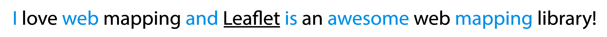
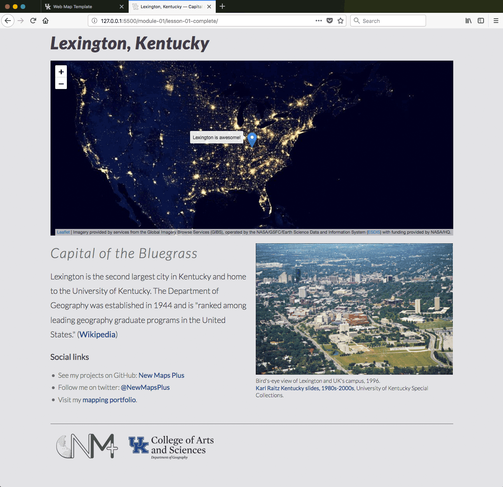

# Lab 01: Building a web map with HTML, CSS, and Javascript

## Table of Contents

<!-- TOC -->

- [Lab 01: Building a web map with HTML, CSS, and Javascript](#lab-01-building-a-web-map-with-html-css-and-javascript)
    - [Table of Contents](#table-of-contents)
    - [Part I. Complete the lesson template (2 pts)](#part-i-complete-the-lesson-template-2-pts)
    - [Part II. Understand the lesson (2 pts)](#part-ii-understand-the-lesson-2-pts)
        - [Quiz questions](#quiz-questions)
    - [Part III. Fantasy vacation! (6 pts)](#part-iii-fantasy-vacation-6-pts)
        - [Steps for completion](#steps-for-completion)
        - [Example page](#example-page)
    - [Challenge: swap out photograph with a click (+1 pt)](#challenge-swap-out-photograph-with-a-click-1-pt)
    - [Submission](#submission)

<!-- /TOC -->

## Part I. Complete the lesson template (2 pts)

For this lab assignment, first complete the Lesson 01 and edit the _index.html_ file included within the _lesson-01/_ directory. Retain this completed file as your web map page template for future exercises.

## Part II. Understand the lesson (2 pts)

Create a new file named *quiz-01.md* within your *map672-module-01-username/lab-01/_* directory.

Write short answers (1 - 2 sentences) to the following questions and save them to the _quiz-01.md_ file. Commit the file to your repository with a good commit message.

Note that the extension *.md* means that this is a Markdown file we're creating. Markdown is a shorthand syntax used for converting text into HTML markdown. GitHub uses Markdown extensively for all the README files and other documentation files, and GitHub's servers render the Markdown as HTML. If you need review, use the following resource on [Mastering Markdown](https://guides.github.com/features/mastering-markdown/). This [Markdown Cheatsheet](https://github.com/adam-p/markdown-here/wiki/Markdown-Here-Cheatsheet) may be useful as well.

All markdown files should begin a single pound `#` sign, which translates to an `h1` heading. Unordered lists can be built using either hypens  `-` or astericks `*`. Ordered (numerical) lists can be build with numbers followed by a period sign:

 ```
 1. list item 1
 2. list item 2
 ```

Using Markdown, answer the following questions:

### Quiz questions

1. What is the purpose of using a local web server (i.e., the code editor's Live Server package), rather than simply opening the *index.html* file in the browser? How do you know if the local server is running correctly?
2. What is the difference between id and class attributes and when would you use one over the other?
3. Write a JavaScript statement that outputs, "Hello World" to the Console in the browser's developer toolbar.
4. Write the following sentence, "I love web mapping and Leaflet is an awesome web mapping library!" as an HTML paragraph element that provides a hyperlink to Leaflet's webpage and every other word is the blue color of #448ee4. Below is an example solution.



## Part III. Fantasy vacation! (6 pts)

Let's imagine a fantastic destination that invites us for a weekend getaway. We'll dream of exotic and exciting places while we practice modifying HTML, CSS, and JavaScript. This is an open-ended and creative first assignment, but we do have a few minimum requirements. 

### Steps for completion

1. Create a folder called "vacation" in this *lab-01* folder. Copy the template *index.html* you created in this lesson. That will be your starting point.
2. Pick a location that you dream of visiting now. Do a little research about that location and write a short paragraph describing why you want to visit and what you would do there.
3. Add a photograph for this location with suitable caption (include source of photo, too)
4. Choose a new color for the hyperlinks and their hover state. Adjust the style rules to achieve this.
5. Choose two new fonts from [Google Fonts](https://fonts.google.com/) for the `h1` and `h2`, `p` and `ul` elements, and update your document to use these.

    * Hint: you'll need to both load the fonts as external resources and update the CSS selector rules.
    * Design tip: Choose two fonts at most for your page. Explore some of these [Google Font Pairings](https://www.reliablepsd.com/ultimate-google-font-pairings/) for inspiration.

6. Within the JavaScript portion of your _index.html_, change the map's center, marker message, and base map layer.

The map center and marker message can be changed easily if you know your location.

```javascript
 var options = {
    center: [38.8826681,-82.3696881],
    zoom: 12
}

var message = 'Woohoo! Biscuit time!';
```

We'll change the base map tiles to a different tile set using [Leaflet-providers preview](https://leaflet-extras.github.io/leaflet-providers/preview/) collection of Leaflet-compatible tile sets. Search for a suitable base map (paying attention `maxZoom` and `api-key` parameters since some are too zoomed out or not free).

Copy the **Plain Javascript** code for the base map you want to use. For example, say you want the classic OpenStreetMap look. Below is what you would copy:

```javascript
var OpenStreetMap_Mapnik = L.tileLayer('https://{s}.tile.openstreetmap.org/{z}/{x}/{y}.png', 
{
	maxZoom: 19,
	attribution: '&copy; <a href="http://www.openstreetmap.org/copyright">OpenStreetMap</a>'
}
);
```
Don't paste this directly into your _index.html_. Instead, split that code block into two variables. Find the `var basemap_url = ` variable definition and replace the existing URL with the new URL surrounding it with quotes `''`. Then, copy the attributes (everythin inside and including the curly braces `{}`) and paste it after `basemap_attributes =`. Pay close attention to your code editor. It will highlight potential syntax errors and help autocomplete statements.

You should see something like this:

```javascript
var basemap_url = 'https://{s}.tile.openstreetmap.org/{z}/{x}/{y}.png'

var basemap_attributes = {
	maxZoom: 19,
	attribution: '&copy; <a href="http://www.openstreetmap.org/copyright">OpenStreetMap</a>'
}
```
Remember to provide comments for the JavaScript portion of your script!

### Example page

Excepting the heading font and hyperlink color, an example page might resemble:




## Challenge: swap out photograph with a click (+1 pt)

Use JS to make your vacation page photograph change when you click the photograph. You should add text above the photograph or in the caption that explains to the visitor what will happen when they click the photo. Of course, change the caption, too!

Use the `.getElementById();` and `.addEventListener('click', function() { });` methods. Consider the following code:

```javascript

// You'll need to create an id for your photograph
var click_photo = document.getElementById('photos_css_id')

// Select an amusing photo to swap out
click_photo.addEventListener('click', function() {
  this.src = "path/to/photo/" // what other attributes can your change?
});
```

Once the image swaps, change the caption text, too.

## Submission

Be sure all your work has been added and committed to your local repository and pushed up to the remote repo. Paste the URL in Canvas to your *map672-module-01-username* by the due date to avoid late penalties. 
