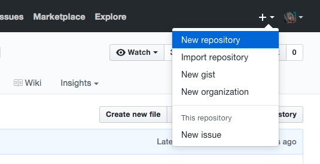
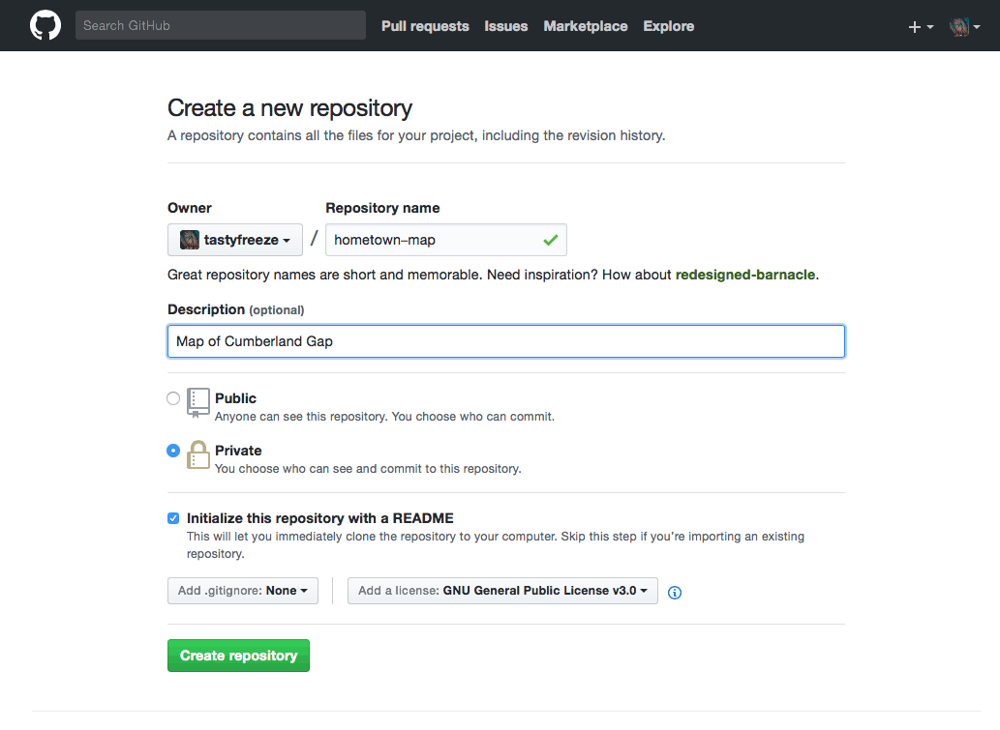
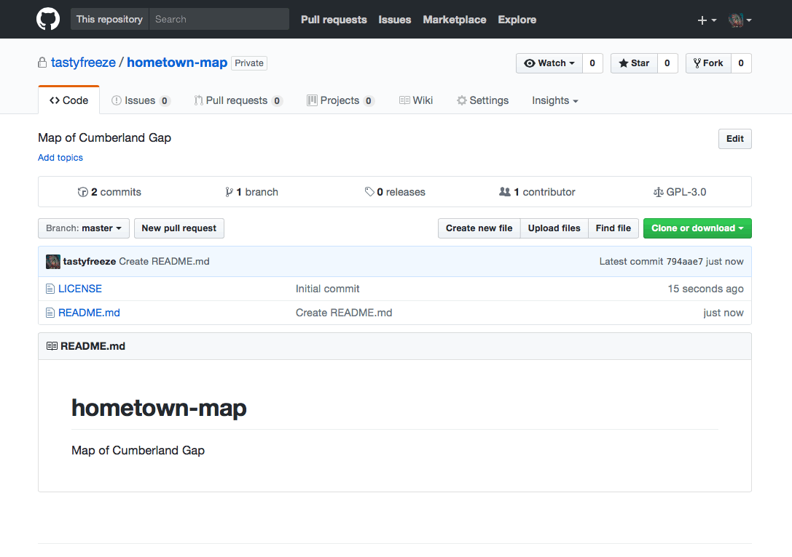
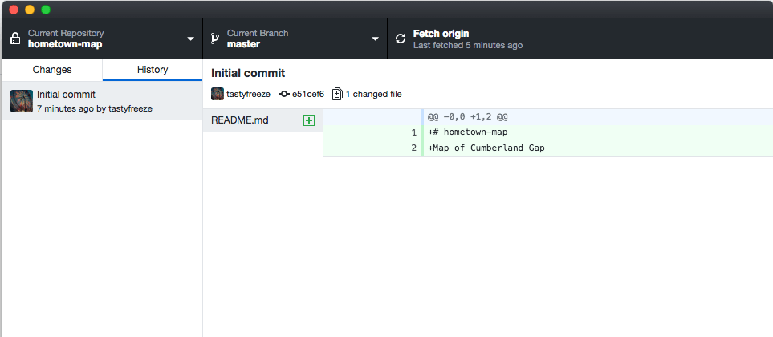
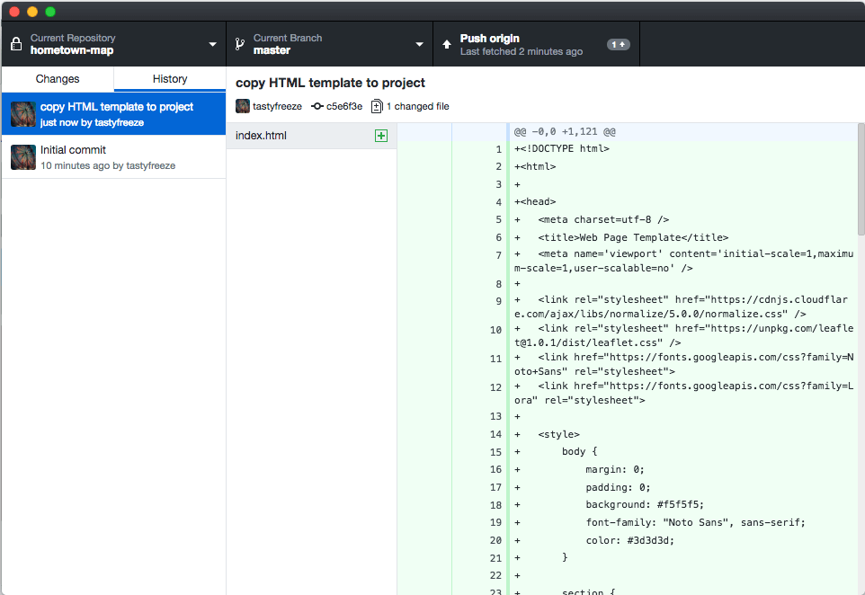
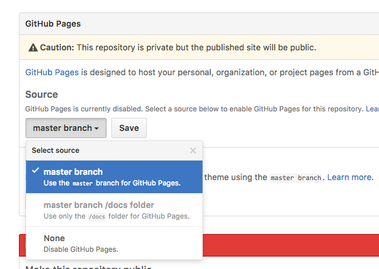

# Creating a new repository on your GitHub account

First create a new repository on the remote GitHub server through the web interface. Navigate to your GitHub account (e.g., *https://github.com/username*). Click on the small plus symbol upper-right and choose **New repository**.

  
**Figure 01.** Creating a new repository in GitHub.

On the next screen, complete the following steps:

* Create a new repository by typing *hometown-map* under the repository name (GitHub repository names may contain no spaces, so the hyphen is important). You don't need to use your hometown, but some town of your choosing and another descriptive name for the repository.
* Provide a brief description of the repository (e.g., "Lexington, KY" or "Git repo for my awesome mapping") where indicated.
* Leave the repository **Public** for now, unless you've been upgraded to the educational account, in which case you can mark it as **Private**.
* Check **Initialize this repository with a README** before clicking the green **Create repository** (it's a good idea to always do this when creating a new repository).
* Finally, **Add a license** for your repository. While private repositories will keep your code hidden while you develop it, a license will instruct people on how they can use your published content. A repository without a license is considered a closed repo with no rights granted to other users. We suggest adding an open license to the work you want to share and get promoted online. Learn more about [licensing a repository](https://help.github.com/articles/licensing-a-repository).

  
**Figure 02.** Creating a new repository in GitHub.

Congratulations! You've created a repository on your GitHub account, currently stored on the GitHub web server. Right now, the only file within your repository is a file named *README.md*. The the GitHub web interface displays the contents of the *README.md* file by default, therefore this file is often used as a textual interface to the project. A *README.md*. file commonly accompanies every new repository to tell users about it.

  
**Figure 03.** Creating a new repository in GitHub

You can clone this repository to your local machine as well, the same way we did above with the module-01 repo. Within your GitHub Desktop application choose **Clone** and this time select your newly created repository. Note that this one will be found under your personal GitHub user account, and not **newmapsplus**.

You'll likely want to save this repo in another directory than your **map671/** directory (or where you'll be saving each weekly module repo from newmapsplus). You may end up creating many repositories with your GitHub account, and it may be useful to keep them organized within a single directory on your machine.

Once I do this, I can see that, like the other freshly-cloned repository, this one has "No Uncommitted Changes", and I can view a simple History with only the initial commit.

  
**Figure 04.** A new repository cloned down from my personal account on GitHub

Within the GitHub Desktop client, we can switch back and forth between our repositories to see the current state of tracking and changing commits. The important thing is to **keep these repositories organized on your filesystem and distinct in your understanding**. They are different directories with different files. Know which ones you are editing within your Atom text editor, and which you are committing to and synchronizing.

Before we wrap up, let's practice the Git add/commit/push process one more time. Within your filesystem GUI (i.e., either Windows or Finder) copy the *index.html* file we edited earlier from the *map671-module-01-username/lab-01/* directory on your local system and paste a copy of this file into your personal repository you just created (e.g., "hometown-map").

Once you do this, you should see the uncommitted change for the "hometown-map" repository shown within GitHub Desktop application.

  
**Figure 05.** 1 Uncommitted Change to an index.html file within the hometown-map repo

Go ahead and write a commit message (e.g., "add index file") and choose **Commit to master** to commit it to the master branch of the Git repo. Then push these changes to your remote repository.

Next, go to your remote repository on GitHub to examine the recently pushed changes. Note that if successful you can see the *index.html* file within the repository at *https://github.com/username/hometown-map*. Here you can click on the file and see all the HTML, CSS, and JavaScript as before in your local text editor.

But how do we get the map to be rendered from this remote repository so we can see the map and not just the code, like we did locally with the atom-live-server? The answer is [GitHub Pages](https://help.github.com/articles/user-organization-and-project-pages/).

Within the **Settings** of your repository on the GitHub website, change the **Source** to "master branch" and choose **Save**.

  
**Figure 06.** Using the master branch of a repository for GitHub Pages

This setting tells GitHub to "serve" or "render" the files in your repository from a web server. How do you access them? You navigate your web browser to *https://username.github.io/repository-name*. If everything is working correctly, you should see your simple web map page "served" correctly to the browser. The difference between this and the earlier process using the atom-live-server is that you can share this URL (and your map) with the world, rather than only viewing on your personal machine.

The final step in our instructional flow is to add a Contributor to your *hometown-map* repository. On your remote GitHub repo **Settings** tab find the **Collaborators & teams** section. Add "boydx" as a collaborator. This will allow the instructor to add commits and see your private repository code.